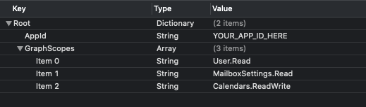

<!-- markdownlint-disable MD002 MD041 -->

Neste exercício, você estenderá o aplicativo do exercício anterior para oferecer suporte à autenticação com o Azure AD. Isso é necessário para obter o token de acesso OAuth necessário para chamar o Microsoft Graph. Para fazer isso, você integrará a [biblioteca de autenticação da Microsoft (MSAL) para IOS](https://github.com/AzureAD/microsoft-authentication-library-for-objc) no aplicativo.

1. Crie um novo arquivo de **lista de propriedades** no projeto do **GraphTutorial** chamado **AuthSettings. plist**.
1. Adicione os seguintes itens ao arquivo no dicionário **raiz** .

    | Chave | Tipo | Valor |
    |-----|------|-------|
    | `AppId` | String | A ID do aplicativo do portal do Azure |
    | `GraphScopes` | Matriz | Dois valores de cadeia `User.Read` de caracteres: e`Calendars.Read` |

    

> [!IMPORTANT]
> Se você estiver usando o controle de origem como o Git, agora seria uma boa hora para excluir o arquivo **AuthSettings. plist** do controle de origem para evitar vazar inadvertidamente sua ID de aplicativo.

## <a name="implement-sign-in"></a>Implementar logon

Nesta seção, você irá configurar o projeto para o MSAL, criar uma classe do Gerenciador de autenticação e atualizar o aplicativo para entrar e sair.

### <a name="configure-project-for-msal"></a>Configurar o Project para o MSAL

1. Adicione um novo grupo de chaves aos recursos do seu projeto.
    1. Selecione o projeto **GraphTutorial** e, em seguida, **assinaturas & recursos**.
    1. Selecione **+ recurso**e, em seguida, clique duas vezes em **compartilhamento de chaves**.
    1. Adicione um grupo de chaves com o valor `com.microsoft.adalcache`.

1. Control clique **info. plist** e selecione **abrir como**e, em seguida, **código-fonte**.
1. Adicione o seguinte no `<dict>` elemento.

    ```xml
    <key>CFBundleURLTypes</key>
    <array>
      <dict>
        <key>CFBundleURLSchemes</key>
        <array>
          <string>msauth.$(PRODUCT_BUNDLE_IDENTIFIER)</string>
        </array>
      </dict>
    </array>
    <key>LSApplicationQueriesSchemes</key>
    <array>
        <string>msauthv2</string>
        <string>msauthv3</string>
    </array>
    ```

1. Abra **AppDelegate. m** e adicione a seguinte instrução de importação na parte superior do arquivo.

    ```objc
    #import <MSAL/MSAL.h>
    ```

1. Adicione a função a seguir à classe `AppDelegate`.

    ```objc
    - (BOOL)application:(UIApplication *)app
                openURL:(NSURL *)url
                options:(NSDictionary<UIApplicationOpenURLOptionsKey,id> *)options
    {
        return [MSALPublicClientApplication handleMSALResponse:url
                                             sourceApplication:options[UIApplicationOpenURLOptionsSourceApplicationKey]];
    }
    ```

### <a name="create-authentication-manager"></a>Criar o Gerenciador de autenticação

1. Crie uma nova **classe Cocoa Touch** no projeto **GraphTutorial** chamado **AuthenticationManager**. Escolha **NSObject** na **subclasse de** Field.
1. Abra **AuthenticationManager. h** e substitua seu conteúdo pelo código a seguir.

    ```objc
    #import <Foundation/Foundation.h>
    #import <MSAL/MSAL.h>
    #import <MSGraphClientSDK/MSGraphClientSDK.h>

    NS_ASSUME_NONNULL_BEGIN

    typedef void (^GetTokenCompletionBlock)(NSString* _Nullable accessToken, NSError* _Nullable error);

    @interface AuthenticationManager : NSObject<MSAuthenticationProvider>

    + (id) instance;
    - (void) getTokenInteractivelyWithParentView: (UIViewController*) parentView andCompletionBlock: (GetTokenCompletionBlock)completionBlock;
    - (void) getTokenSilentlyWithCompletionBlock: (GetTokenCompletionBlock)completionBlock;
    - (void) signOut;
    - (void) getAccessTokenForProviderOptions:(id<MSAuthenticationProviderOptions>)authProviderOptions andCompletion:(void (^)(NSString *, NSError *))completion;

    @end

    NS_ASSUME_NONNULL_END
    ```

1. Abra **AuthenticationManager. m** e substitua seu conteúdo pelo código a seguir.

    ```objc
    #import "AuthenticationManager.h"

    @interface AuthenticationManager()

    @property NSString* appId;
    @property NSArray<NSString*>* graphScopes;
    @property MSALPublicClientApplication* publicClient;

    @end

    @implementation AuthenticationManager

    + (id) instance {
        static AuthenticationManager *singleInstance = nil;
        static dispatch_once_t onceToken;
        dispatch_once(&onceToken, ^ {
            singleInstance = [[self alloc] init];
        });

        return singleInstance;
    }

    - (id) init {
        if (self = [super init]) {
            // Get app ID and scopes from AuthSettings.plist
            NSString* authConfigPath =
            [NSBundle.mainBundle pathForResource:@"AuthSettings" ofType:@"plist"];
            NSDictionary* authConfig = [NSDictionary dictionaryWithContentsOfFile:authConfigPath];

            self.appId = authConfig[@"AppId"];
            self.graphScopes = authConfig[@"GraphScopes"];

            // Create the MSAL client
            self.publicClient = [[MSALPublicClientApplication alloc] initWithClientId:self.appId error:nil];
        }

        return self;
    }

    - (void) getAccessTokenForProviderOptions:(id<MSAuthenticationProviderOptions>)authProviderOptions andCompletion:(void (^)(NSString * _Nonnull, NSError * _Nonnull))completion {
        [self getTokenSilentlyWithCompletionBlock:completion];
    }

    - (void) getTokenInteractivelyWithParentView:(UIViewController *)parentView andCompletionBlock:(GetTokenCompletionBlock)completionBlock {
        MSALWebviewParameters* webParameters = [[MSALWebviewParameters alloc] initWithParentViewController:parentView];
        MSALInteractiveTokenParameters* interactiveParameters =
        [[MSALInteractiveTokenParameters alloc]initWithScopes:self.graphScopes webviewParameters:webParameters];

        // Call acquireToken to open a browser so the user can sign in
        [self.publicClient
         acquireTokenWithParameters:interactiveParameters
         completionBlock:^(MSALResult * _Nullable result, NSError * _Nullable error) {

            // Check error
            if (error) {
                completionBlock(nil, error);
                return;
            }

            // Check result
            if (!result) {
                NSMutableDictionary* details = [NSMutableDictionary dictionary];
                [details setValue:@"No result was returned" forKey:NSDebugDescriptionErrorKey];
                completionBlock(nil, [NSError errorWithDomain:@"AuthenticationManager" code:0 userInfo:details]);
                return;
            }

            NSLog(@"Got token interactively: %@", result.accessToken);
            completionBlock(result.accessToken, nil);
        }];
    }

    - (void) getTokenSilentlyWithCompletionBlock:(GetTokenCompletionBlock)completionBlock {
        // Check if there is an account in the cache
        NSError* msalError;
        MSALAccount* account = [self.publicClient allAccounts:&msalError].firstObject;

        if (msalError || !account) {
            NSMutableDictionary* details = [NSMutableDictionary dictionary];
            [details setValue:@"Could not retrieve account from cache" forKey:NSDebugDescriptionErrorKey];
            completionBlock(nil, [NSError errorWithDomain:@"AuthenticationManager" code:0 userInfo:details]);
            return;
        }

        MSALSilentTokenParameters* silentParameters = [[MSALSilentTokenParameters alloc] initWithScopes:self.graphScopes
                                                                                                account:account];

        // Attempt to get token silently
        [self.publicClient
         acquireTokenSilentWithParameters:silentParameters
         completionBlock:^(MSALResult * _Nullable result, NSError * _Nullable error) {
             // Check error
             if (error) {
                 completionBlock(nil, error);
                 return;
             }

             // Check result
             if (!result) {
                 NSMutableDictionary* details = [NSMutableDictionary dictionary];
                 [details setValue:@"No result was returned" forKey:NSDebugDescriptionErrorKey];
                 completionBlock(nil, [NSError errorWithDomain:@"AuthenticationManager" code:0 userInfo:details]);
                 return;
             }

             NSLog(@"Got token silently: %@", result.accessToken);
             completionBlock(result.accessToken, nil);
         }];
    }

    - (void) signOut {
        NSError* msalError;
        NSArray* accounts = [self.publicClient allAccounts:&msalError];

        if (msalError) {
            NSLog(@"Error getting accounts from cache: %@", msalError.debugDescription);
            return;
        }

        for (id account in accounts) {
            [self.publicClient removeAccount:account error:nil];
        }
    }

    @end
    ```

### <a name="add-sign-in-and-sign-out"></a>Adicionar entrada e saída

1. Abra o arquivo **SignInViewController. m** e substitua seu conteúdo pelo código a seguir.

    ```objc
    #import "SignInViewController.h"
    #import "SpinnerViewController.h"
    #import "AuthenticationManager.h"

    @interface SignInViewController ()
    @property SpinnerViewController* spinner;
    @end

    @implementation SignInViewController

    - (void)viewDidLoad {
        [super viewDidLoad];
        // Do any additional setup after loading the view.

        self.spinner = [SpinnerViewController alloc];
        [self.spinner startWithContainer:self];

        [AuthenticationManager.instance
         getTokenSilentlyWithCompletionBlock:^(NSString * _Nullable accessToken, NSError * _Nullable error) {
             dispatch_async(dispatch_get_main_queue(), ^{
                 [self.spinner stop];

                 if (error || !accessToken) {
                     // If there is no token or if there's an error,
                     // no user is signed in, so stay here
                     return;
                 }

                 // Since we got a token, user is signed in
                 // Go to welcome page
                 [self performSegueWithIdentifier: @"userSignedIn" sender: nil];
             });
        }];
    }

    - (IBAction)signIn {
        self.spinner = [SpinnerViewController alloc];
        [self.spinner startWithContainer:self];

        [AuthenticationManager.instance
         getTokenInteractivelyWithParentView:self
         andCompletionBlock:^(NSString * _Nullable accessToken, NSError * _Nullable error) {
             dispatch_async(dispatch_get_main_queue(), ^{
                 [self.spinner stop];

                 if (error || !accessToken) {
                     // Show the error and stay on the sign-in page
                     UIAlertController* alert = [UIAlertController
                                                 alertControllerWithTitle:@"Error signing in"
                                                 message:error.debugDescription
                                                 preferredStyle:UIAlertControllerStyleAlert];

                     UIAlertAction* okButton = [UIAlertAction
                                                actionWithTitle:@"OK"
                                                style:UIAlertActionStyleDefault
                                                handler:nil];

                     [alert addAction:okButton];
                     [self presentViewController:alert animated:true completion:nil];
                     return;
                 }

                 // Since we got a token, user is signed in
                 // Go to welcome page
                 [self performSegueWithIdentifier: @"userSignedIn" sender: nil];
             });
         }];
    }
    @end
    ```

1. Abra **WelcomeViewController. m** e substitua a função `signOut` existente pelo seguinte.

    ```objc
    - (IBAction)signOut {
        [AuthenticationManager.instance signOut];
        [self performSegueWithIdentifier: @"userSignedOut" sender: nil];
    }
    ```

1. Salve suas alterações e reinicie o aplicativo no simulador.

Se você entrar no aplicativo, verá um token de acesso exibido na janela de saída do Xcode.


## <a name="get-user-details"></a>Obter detalhes do usuário

Nesta seção, você criará uma classe auxiliar para manter todas as chamadas para o Microsoft Graph e atualizará `WelcomeViewController` o para usar essa nova classe para obter o usuário conectado.

1. Crie uma nova **classe Cocoa Touch** no projeto **GraphTutorial** chamado **graphmanager**. Escolha **NSObject** na **subclasse de** Field.
1. Abra **graphmanager. h** e substitua seu conteúdo pelo código a seguir.

    ```objc
    #import <Foundation/Foundation.h>
    #import <MSGraphClientSDK/MSGraphClientSDK.h>
    #import <MSGraphClientModels/MSGraphClientModels.h>
    #import "AuthenticationManager.h"

    NS_ASSUME_NONNULL_BEGIN

    typedef void (^GetMeCompletionBlock)(MSGraphUser* _Nullable user, NSError* _Nullable error);

    @interface GraphManager : NSObject

    + (id) instance;
    - (void) getMeWithCompletionBlock: (GetMeCompletionBlock)completionBlock;

    @end

    NS_ASSUME_NONNULL_END
    ```

1. Abra **graphmanager. m** e substitua seu conteúdo pelo código a seguir.

    ```objc
    #import "GraphManager.h"

    @interface GraphManager()

    @property MSHTTPClient* graphClient;

    @end

    @implementation GraphManager

    + (id) instance {
        static GraphManager *singleInstance = nil;
        static dispatch_once_t onceToken;
        dispatch_once(&onceToken, ^ {
            singleInstance = [[self alloc] init];
        });

        return singleInstance;
    }

    - (id) init {
        if (self = [super init]) {
            // Create the Graph client
            self.graphClient = [MSClientFactory
                                createHTTPClientWithAuthenticationProvider:AuthenticationManager.instance];
        }

        return self;
    }

    - (void) getMeWithCompletionBlock:(GetMeCompletionBlock)completionBlock {
        // GET /me
        NSString* meUrlString = [NSString stringWithFormat:@"%@/me", MSGraphBaseURL];
        NSURL* meUrl = [[NSURL alloc] initWithString:meUrlString];
        NSMutableURLRequest* meRequest = [[NSMutableURLRequest alloc] initWithURL:meUrl];

        MSURLSessionDataTask* meDataTask =
        [[MSURLSessionDataTask alloc]
            initWithRequest:meRequest
            client:self.graphClient
            completion:^(NSData *data, NSURLResponse *response, NSError *error) {
                if (error) {
                    completionBlock(nil, error);
                    return;
                }

                // Deserialize the response as a user
                NSError* graphError;
                MSGraphUser* user = [[MSGraphUser alloc] initWithData:data error:&graphError];

                if (graphError) {
                    completionBlock(nil, graphError);
                } else {
                    completionBlock(user, nil);
                }
            }];

        // Execute the request
        [meDataTask execute];
    }

    @end
    ```

1. Abra **WelcomeViewController. m** e adicione as seguintes `#import` instruções na parte superior do arquivo.

    ```objc
    #import "SpinnerViewController.h"
    #import "GraphManager.h"
    #import <MSGraphClientModels/MSGraphClientModels.h>
    ```

1. Adicione a seguinte propriedade à Declaração `WelcomeViewController` de interface.

    ```objc
    @property SpinnerViewController* spinner;
    ```

1. Substitua o existente `viewDidLoad` pelo código a seguir.

    ```objc
    - (void)viewDidLoad {
        [super viewDidLoad];
        // Do any additional setup after loading the view.

        self.spinner = [SpinnerViewController alloc];
        [self.spinner startWithContainer:self];

        self.userProfilePhoto.image = [UIImage imageNamed:@"DefaultUserPhoto"];

        [GraphManager.instance
         getMeWithCompletionBlock:^(MSGraphUser * _Nullable user, NSError * _Nullable error) {
            dispatch_async(dispatch_get_main_queue(), ^{
                [self.spinner stop];

                if (error) {
                    // Show the error
                    UIAlertController* alert = [UIAlertController
                                                alertControllerWithTitle:@"Error getting user profile"
                                                message:error.debugDescription
                                                preferredStyle:UIAlertControllerStyleAlert];

                    UIAlertAction* okButton = [UIAlertAction
                                               actionWithTitle:@"OK"
                                               style:UIAlertActionStyleDefault
                                               handler:nil];

                    [alert addAction:okButton];
                    [self presentViewController:alert animated:true completion:nil];
                    return;
                }

                // Set display name
                self.userDisplayName.text = user.displayName ? : @"Mysterious Stranger";
                [self.userDisplayName sizeToFit];

                // AAD users have email in the mail attribute
                // Personal accounts have email in the userPrincipalName attribute
                self.userEmail.text = user.mail ? : user.userPrincipalName;
                [self.userEmail sizeToFit];
            });
         }];
    }
    ```

Se você salvar suas alterações e reiniciar o aplicativo agora, após entrar, a interface do usuário será atualizada com o nome de exibição e o endereço de email do usuário.
